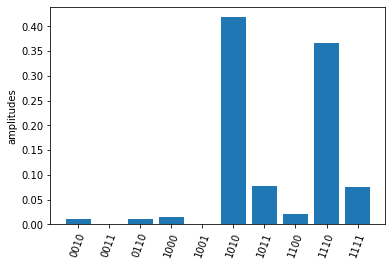
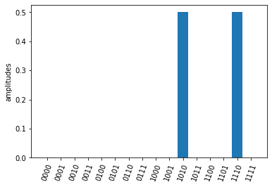
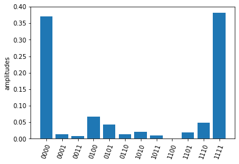
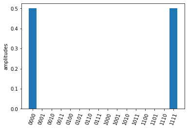
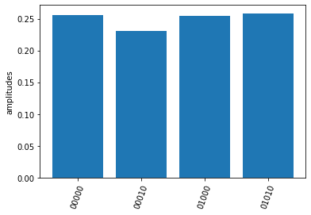
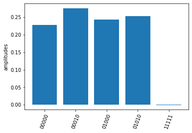

# Quafu document
## Installation

Run following codes in command line
```shell
git clone https://github.com/ScQ-Cloud/quafu
cd quafu
python setup.py build
python setup.py install
```
## Set up your Quafu account
To use the toolkit quafu, firstly you need to register on the [Quafu](http://120.46.160.173/) website and get your apitoken `<your API token>`. If you already have an account, execute the follow code to set up your account.


```python
from quafu import User
user = User()
user.save_apitoken(<your API token>)
```

 You only need to save your token once and no longer need to execute above code when you use quafu after, except you want to change your account.

## Build your first quantum circuit

Initialize a circuit with 5 qubits


```python
import numpy as np
from quafu import QuantumCircuit

q = QuantumCircuit(5)
```

Add quantum gates. For quantum gates Quafu supports, please check the API reference for [`QuantumCircuit`](#quafu.QuantumCircuit)


```python
q.x(0)
q.x(1) 
q.cnot(2, 1) 
q.ry(1, np.pi/2) 
q.rx(2, np.pi) 
q.rz(3, 0.1) 
q.cz(2, 3) 
```


    <quafu.circuits.quantum_circuit.QuantumCircuit at 0x23a358ae850>


Add measurement information including qubits measured (`measures`) and the classical bits keeping the measured results (`cbits`). If there is no measurement information provided, all qubits are measured by default.  


```python
measures = [0, 1, 2, 3]
cbits = [0, 1, 2, 3]
q.measure(measures,  cbits=cbits)
```

You can draw the circuit using the [`draw_circuit`](#quafu.circuits.quantum_circuit.QuantumCircuit.draw_circuit) method


```python
q.draw_circuit()
```

    q[0]  -----X-------------------------- M->c[0]
                                          
    q[1]  -----X-------+---RY(1.571)------ M->c[1]
                       |                  
    q[2]  -------------*---RX(3.142)---*-- M->c[2]
                                       CZ 
    q[3]  -RZ(0.100)-------------------+-- M->c[3]
    

You can also initial your quantum circuit with openqasm text. [`QuantumCircuit`](#quafu.QuantumCircuit) class provides the [`from_openqasm`](#quafu.circuits.quantum_circuit.QuantumCircuit.from_openqasm) method for initializing quantum circuit directly from openqasm.


```python
qc = QuantumCircuit(4)
test_ghz = """OPENQASM 2.0;
include "qelib1.inc";
qreg q[4];
h q[0];
cx q[0],q[1];
cx q[0],q[2];
cx q[0],q[3];
"""
qc.from_openqasm(test_ghz)
qc.draw_circuit()
```

    q[0]  -H---*----*----*-- M->c[0]
               |    |    |  
    q[1]  -----+----|----|-- M->c[1]
                    |    |  
    q[2]  ----------+----|-- M->c[2]
                         |  
    q[3]  ---------------+-- M->c[3]
    

## Submit your circuit
Now you are ready to submit the circuit to the experimental backend. First initial a Task object and load your account. 


```python
from quafu import Task
task = Task()
task.load_account()
```

You can configure your task properties using the [`config`](#quafu.tasks.tasks.Task.config) method. Here we choose the backend (`backend`) as `ScQ-P10`, the single shots number (`shots`) as 2000 and to compile the circuit on backend (`compile`). 


```python
task.config(backend="ScQ-P10", shots=2000, compile=True)
```

If you set the `compile` parameter to `False`, make sure that you know the topology of the backend well and submit valid circuit.

Send the quantum circuit to the backend. Here we send circuit `q`.


```python
res = task.send(q)
```

You can use the returned results to check the count and amplitude on each measured bit string. The output bits are arranged as 0, 1, 2,... from left to the right.


```python

print(res.counts) #counts
print(res.amplitudes) #amplitude
res.plot_amplitudes()
```

    OrderedDict([('0010', 22), ('0011', 2), ('0110', 20), ('1000', 30), ('1001', 2), ('1010', 837), ('1011', 156), ('1100', 44), ('1110', 734), ('1111', 153)])
    {'0010': 0.011, '0011': 0.001, '0110': 0.01, '1000': 0.015, '1001': 0.001, '1010': 0.4185, '1011': 0.078, '1100': 0.022, '1110': 0.367, '1111': 0.0765}
    


    

    


If you want to check the correctness the execute results. Quafu provide simple circuit similator based on the qutip pacakge.


```python
from quafu.simulators.qutip_simulator import simulate
simu_res = simulate(q)
simu_res.plot_amplitudes(full=True)
```


    

    


You can also submit the 4-bit ghz circuit `qc` built from openqasm.


```python
res = task.send(qc)
res.plot_amplitudes()

simu_res = simulate(qc)
simu_res.plot_amplitudes()
```


    

    


    

    


If you don't want to plot the results for basis with zero amplitudes, set the parameter `full` in method [`plot_amplitudes`](#quafu.results.results.SimuResult.plot_amplitudes) to False. Note that this parameter is only valid for results returned by simulator.  

## Submit circuit and measure observables

Quafu provides measuring observables with an excuted quantum circuit. You can input Pauli operators that need to measure expectation values to the [`submit`](#quafu.tasks.tasks.Task.submit) method.
For example, you can input [["XYX", [0, 1, 2]], ["Z", [1]]] to calcuate the expectation of operators $\sigma^x_0\sigma^y_1\sigma^x_2$ and $\sigma^z_1$.
The [`submit`](#quafu.tasks.tasks.Task.submit) method will minimize the executing times of the circuit with different measurement basis that can calculate all expectations of input operators. 

Here we show how to measure the energy expection of the Ising chain
$$H=\sum_i \sigma^z_i \sigma^z_{i+1} + g \sum_i \sigma^x_i.$$

First we initialize a circuit with three Hadamard gate


```python
q = QuantumCircuit(5)

for i in range(5):
    if i % 2 == 0:
        q.h(i)

q.draw_circuit()
measures = list(range(5))
q.measure(measures)

```

    q[0]  -H- M->c[0]
             
    q[1]  --- M->c[1]
             
    q[2]  -H- M->c[2]
             
    q[3]  --- M->c[3]
             
    q[4]  -H- M->c[4]
    

Next we set operators that need to be measured to calculate the energy expectation, and submit the circuit using [`submit`](#quafu.tasks.tasks.Task.submit) method


```python
test_Ising = [["X", [i]] for i in range(5)]
test_Ising.extend([["ZZ", [i, i+1]] for i in range(4)])
res, obsexp = task.submit(q, test_Ising)
```

    Job start, need measured in  [['XXXXX', [0, 1, 2, 3, 4]], ['ZZZZZ', [0, 1, 2, 3, 4]]]
    

The function return measurement results and operator expectations. The measurement results only contain two ExecResult object since the circuit is only executed twice, with measurement basis  [['XXXXX', [0, 1, 2, 3, 4]] and ['ZZZZZ', [0, 1, 2, 3, 4]]] respectively.


```python

res[0].plot_amplitudes()
res[1].plot_amplitudes()

```


    

    


    

    


The return operator expectations (`obsexp`) is a list with a length equal to the input operator number. We can use it to calculate the energy expectation 


```python
print(obsexp)
g = 0.5
E = g*sum(obsexp[:5])+sum(obsexp[5:])
print(E)

```

    [0.9930000000000001, -0.018000000000000016, 1.001, 0.03200000000000003, 1.001, 0.007000000000000006, 0.007000000000000006, -0.05800000000000005, -0.05800000000000005]
    1.4024999999999999
    

##API Reference
::: quafu
